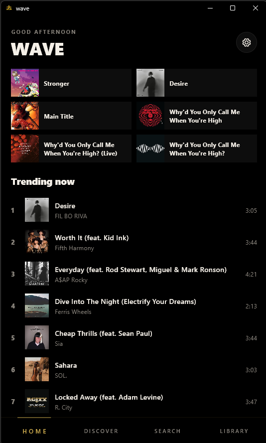
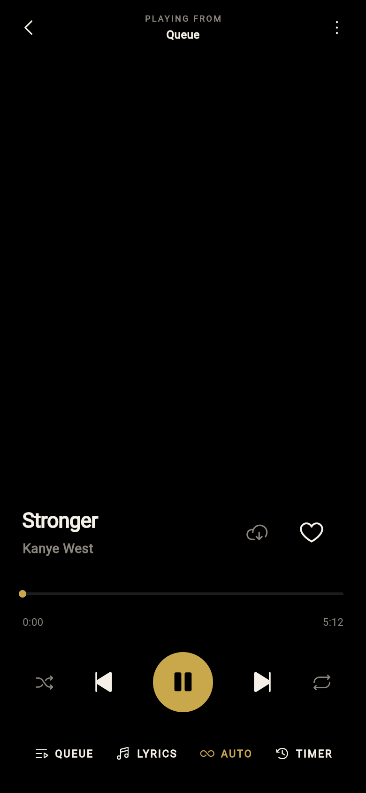
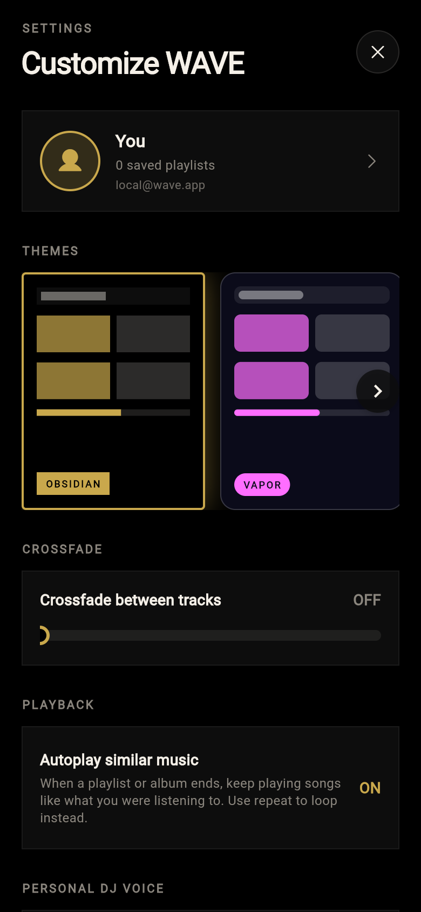

  
  <h1>WAVE</h1>
  
A fast, cross-platform music streaming app built with Flutter.

  
<strong>Latest release:</strong> <a href="https://github.com/killamfkr/WAVE/releases/latest">v1.2.3</a>

---

## Overview

WAVE is a modern music client for streaming, library management, and personalized listening. It resolves Deezer metadata and plays audio via a high-quality pipeline, with offline downloads, synced lyrics, visual themes, and cloud backup for your library.

## Features

- **High Quality Streaming**: Fast track loading with direct streaming, proactive URL refresh, and resilient playback recovery.
- **Personal DJ**: Spotify-style personalized mixes from your likes, recent plays, and similar tracks — with mood controls (Mixed, Chill, Hype, Discover) and spoken radio-style DJ voice lines (no on-screen captions).
- **Dynamic DJ TTS**: Choose **Free (Edge)**, **OpenAI**, or **ElevenLabs** in Settings → Personal DJ Voice. Add your own API key for premium cloud voices; WAVE falls back to free Edge TTS automatically.
- **Autoplay Similar**: When a playlist or album ends, WAVE keeps going with similar music. Toggle AUTO from Now Playing or Settings → Playback.
- **Repeat Modes**: Off, repeat all, or repeat one.
- **Audio Focus**: Pauses automatically when another app takes audio focus or headphones are unplugged.
- **Cloud Sync**: Sign in with email/password (Supabase, shared with PlayTorrio/Stories) to sync playlists, liked songs, equalizer settings, and library data across devices.
- **Local Profile**: Set a display name and avatar in Settings; syncs to the cloud when signed in.
- **Android Auto**: Browse and play your library from Android Auto.
- **Visual Themes**: Aurora, Brutalist, Minimal Mono, Neon Grid, Obsidian, and Vapor — each with distinct layout and motion.
- **Synced Lyrics**: In-app synced lyrics from multiple provider backends.
- **Queue Management**: Full control over upcoming, current, and historical tracks, including drag-to-reorder.
- **Downloads**: Save tracks locally for offline playback.
- **Playlists & Library**: Create, import, and export playlists. Follow artists and track recently played music.
- **Recommendation Engine**: Discover tracks and artists based on your library, likes, and playback history (Last.fm + Deezer).
- **Crossfade & Equalizer**: Gapless playback with customizable crossfade; 5-band EQ synced to the cloud.

## Screenshots

  <h3>Homescreen</h3>
  
  
  <h3>Now Playing</h3>
  
  
  <h3>Settings</h3>
  

## Recent Updates

| Version | Highlights |
|---------|------------|
| **1.2.3** | Personal DJ moods shape the mix — chill, hype, and discover change track selection |
| **1.2.2** | Personal DJ larger queue — multi-seed mixes, auto-refill, less repetition |
| **1.2.1** | DJ first song matches opener; deeper baritone voice |
| **1.2.0** | Dynamic DJ TTS — OpenAI & ElevenLabs with secure API key storage |
| **1.1.8** | Fix DJ female voice fallback; use AndrewNeural on Edge TTS |
| **1.1.6** | Fix DJ music playback during voice lines; faster male Edge voice |
| **1.1.5** | Fix silent DJ voice (Edge TTS MP3 parsing + on-device fallback) |
| **1.1.4** | Edge neural TTS; removed on-screen DJ captions |
| **1.1.3** | Natural DJ scripts and paced TTS |
| **1.1.2** | Fix hardcoded version display in Settings |
| **1.1.1** | Spoken Personal DJ voice with music ducking |
| **1.1.0** | Personal DJ — personalized mixes, mood controls, liner commentary |
| **1.0.9** | Pause when another app takes audio focus |
| **1.0.8** | Playback stability — fixes CD-skip stutter during long sessions |
| **1.0.7** | Autoplay similar when queue ends + AUTO toggle |
| **1.0.6** | Cloud sync for liked songs and equalizer settings |
| **1.0.5** | Playback recovery, repeat-all/one fixes, stream URL refresh |

[View all releases](https://github.com/killamfkr/WAVE/releases)

## Technical Stack

- **Framework**: Flutter (Dart)
- **Audio Engine**: MediaKit (libmpv) + audio_service
- **DJ Voice**: Edge TTS, OpenAI `gpt-4o-mini-tts`, ElevenLabs, flutter_tts fallback
- **State Management**: Riverpod
- **Local Storage**: Hive + Flutter Secure Storage (API keys)
- **Cloud Sync**: Supabase
- **Metadata**: Deezer API, Last.fm

## Downloads

Android APKs are attached to each [GitHub Release](https://github.com/killamfkr/WAVE/releases):

- **Most phones** → `WAVE-arm64-v8a-release.apk`
- **Older 32-bit devices** → `WAVE-armeabi-v7a-release.apk`
- **Emulators / x86 tablets** → `WAVE-x86_64-release.apk`

## Personal DJ setup (optional)

1. Open **Settings → Personal DJ Voice**
2. Pick **Free (Edge)**, **OpenAI**, or **ElevenLabs**
3. For cloud voices, paste your API key and tap **Save key**
4. Start a session from the **Personal DJ** card on Home

Keys stay on your device. Cloud TTS usage bills to your API account. If synthesis fails, WAVE falls back to the free Edge voice automatically.
